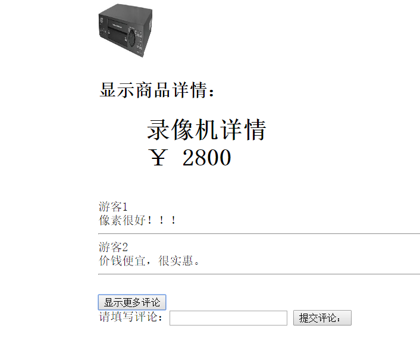
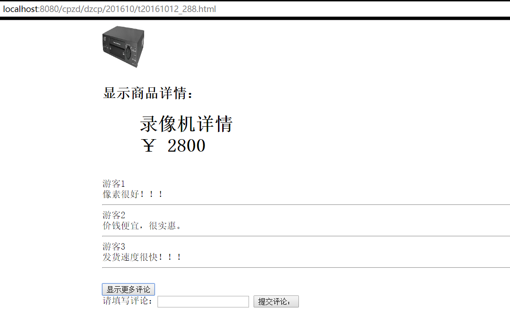

# Study4
评论互动功能实现

项目GitHub地址：https://github.com/WangJieWJ/ProductReview.git

项目GitLab地址：git@gitlab.trs.com:wangjie/ProductReview.git

## 数据库设计

```sql
-- 创建评论表
create table review(
RID int auto_increment primary key,  	       		 -- 评论的编号
RNAME varchar(20) not null,		       		 -- 评论商品的名字
RCONTENT varchar(200) not null,				 -- 评论内容
RDATE DATETIME	default CURRENT_TIMESTAMP		 -- 评论时间
);
```

## 后台






1、Season启动类：APP.java
```java
package com.trs.config;
import com.season.core.spring.SeasonApplication;
import com.season.core.spring.SeasonRunner;

/**
 * Created by wangjie on 2016/10/14 0014.
 */

public class App extends SeasonApplication {

    public static void main(String[] args){
        SeasonRunner.run(App.class,args);
    }

}
```

2、配置启动类：ServletInitializer.java
```java
package com.trs.config;

import com.season.core.spring.SeasonServletInitializer;

/**
 * Created by wangjie on 2016/10/14 0014.
 */
public class ServletInitializer extends SeasonServletInitializer{
    @Override
    protected Class<?> getAppClass() {
        return App.class;
    }
}
```
3、处理请求：TestController.java
```java
package com.trs.controller;

import com.alibaba.fastjson.JSON;
import com.alibaba.fastjson.JSONArray;
import com.season.core.ActionKey;
import com.season.core.Controller;
import com.season.core.ControllerKey;
import com.trs.domain.Review;
import com.trs.service.ReviewService;
import com.trs.utils.StringUtils;
import org.springframework.beans.factory.annotation.Autowired;

import java.util.List;

/**
 * Created by wangjie on 2016/10/20 0020.
 */
@ControllerKey(value = "hello")
public class ReviewController extends Controller{

    @Autowired
    private ReviewService reviewService;

    /**
     * 查找相关商品的评论
     */
    @ActionKey(value = "get")
    public void getReviewsByName(){
        String reviewName=getPara("reviewName");
        if(StringUtils.hasLength(reviewName)){
            List<Review> lists=reviewService.getReviewsByName(reviewName);
            renderText(((JSON)JSONArray.toJSON(lists)).toJSONString());
            return;
        }else{
            renderText("参数未赋值！");
        }
    }

    /**
     * 处理评论保存
     */
    @ActionKey(value = "save")
    public void saveReview(){
        String reviewName=getPara("reviewName");
        String reviewContent=getPara("reviewContent");
        if(StringUtils.hasLength(reviewName) && StringUtils.hasLength(reviewContent)){
            Review review=new Review(reviewName,reviewContent);
            reviewService.saveReview(review);
            return;
        }else{
            renderText("缺少参数值！");
        }

    }
}
```

4、数据库层：ReviewDao.java
```java
package com.trs.dao;

import com.season.core.db.Dao;
import com.trs.domain.Review;
import org.springframework.stereotype.Repository;

import java.util.List;

/**
 * Created by wangjie on 2016/10/20 0020.
 */
@Repository
public class ReviewDao {

    /**
     * 按照商品名字查找评论信息
     * @param reviewName
     * @return  返回该商品的所有评论
     */
    public List<Review> getReviewsByName(String reviewName){
        return Dao.findByColumn(Review.class,"reviewName",reviewName);
    }

    /**
     * 保存评论
     * @param review
     * @return 当前保存的评论，具有所有字段信息
     */
    public Review saveReview(Review review){
        return review.save();
    }
}
```

5、实体类：Review.java
```java
package com.trs.domain;

import com.season.core.db.Pojo;
import com.season.core.db.annotation.TableInfo;
import com.season.core.db.annotation.Transient;

import java.util.Date;

/**
 * Created by wangjie on 2016/10/20 0020.
 */
@TableInfo(tableName = Review.tabelName,pkName = "reviewId")
public class Review extends Pojo<Review>{

    @Transient
    public final static String tabelName="review";

    private int reviewId;  //参数名称设置····
    private String reviewName;
    private String reviewContent;
    private Date reviewDate;   //日期类型的数据

    public int getReviewId() {
        return reviewId;
    }

    public void setReviewId(int reviewId) {
        this.reviewId = reviewId;
    }

    public String getReviewName() {
        return reviewName;
    }

    public void setReviewName(String reviewName) {
        this.reviewName = reviewName;
    }

    public String getReviewContent() {
        return reviewContent;
    }

    public void setReviewContent(String reviewContent) {
        this.reviewContent = reviewContent;
    }

    public Date getReviewDate() {
        return reviewDate;
    }

    public void setReviewDate(Date reviewDate) {
        this.reviewDate = reviewDate;
    }

    public Review() {
    }

    public Review(String reviewName, String reviewContent) {
        this.reviewName = reviewName;
        this.reviewContent = reviewContent;
    }

    public Review(int reviewId, String reviewName, String reviewContent, Date reviewDate) {
        this.reviewId = reviewId;
        this.reviewName = reviewName;
        this.reviewContent = reviewContent;
        this.reviewDate = reviewDate;
    }
}
```

6、业务层：ReviewService.java  
```java
package com.trs.service;

import com.trs.dao.ReviewDao;
import com.trs.domain.Review;
import org.springframework.beans.factory.annotation.Autowired;
import org.springframework.stereotype.Service;

import java.util.List;

/**
 * Created by wangjie on 2016/10/20 0020.
 */
@Service
public class ReviewService {

    @Autowired
    private ReviewDao reviewDao;

    /**
     * 通过商品名称来获取评论，
     * @param reviewName
     * @return
     */
    public List<Review>  getReviewsByName(String reviewName){
        return reviewDao.getReviewsByName(reviewName);
    }

    /**
     * 保存评论
     * @param review
     * @return
     */
    public Review saveReview(Review review){
        return reviewDao.saveReview(review);
    }
}
```

7、配置文件 pom.xml
```xml
<?xml version="1.0" encoding="UTF-8"?>
<project xmlns="http://maven.apache.org/POM/4.0.0"
         xmlns:xsi="http://www.w3.org/2001/XMLSchema-instance"
         xsi:schemaLocation="http://maven.apache.org/POM/4.0.0 http://maven.apache.org/xsd/maven-4.0.0.xsd">
    <modelVersion>4.0.0</modelVersion>

    <groupId>trs.com.cn1</groupId>
    <artifactId>SeasonConnectSQL</artifactId>
    <version>1.0-SNAPSHOT</version>
    <packaging>jar</packaging>

    <parent>
        <artifactId>season-parent</artifactId>
        <groupId>trs.com.cn</groupId>
        <version>1.4-SNAPSHOT</version>
    </parent>

    <dependencies>
        <dependency>
            <groupId>trs.com.cn</groupId>
            <artifactId>season-core</artifactId><!-- 其中包含了好多依赖  -->
        </dependency>
    </dependencies>

    <!--因为Season代码发布在海尔仓库中，所以要引入海尔代码仓库-->
    <repositories>
        <repository>
           <id>haier-maven-repository</id>
            <url>http://test.haier.com/nexus/content/groups/public/</url>
        </repository>
    </repositories>


    <build>
        <finalName>SeasonConnectionSQL</finalName>
        <plugins>
            <plugin>
                <groupId>org.springframework.boot</groupId>
                <artifactId>spring-boot-maven-plugin</artifactId>
            </plugin>
        </plugins>
    </build>

</project>
```

8、StringUtils.java
```java
package com.trs.utils;

/**
 * Created by wangjie on 2016/10/20 0020.
 */
public class StringUtils {
    public static boolean hasLength(String s){
        return s !=null && !"".equals(s.trim());
    }
}
```

## 商品详情页HTML代码
```html
<!DOCTYPE html PUBLIC "-//W3C//DTD XHTML 1.0 Transitional//EN http://www.w3.org/TR/xhtml1/DTD/xhtml1-transitional.dtd">
<html lang="cn">
<head>
<META content="text/html; charset=UTF-8" http-equiv=Content-Type>
<h1 style="display:none" class="nav_hide">产品详情</h1>
<title>产品详情</title>

<script type="text/javascript" src="../../JS/jquery-1.8.3.js"></script>
<script type="text/javascript">
$(document).ready(function(){

$("#b05").click(function(){
	 $.getJSON("http://localhost:8080/hello/get",
	 {"reviewName":$("#b05_1").attr("value")},   //向后台传递参数  商品的名称！！！
	 function(data) {
        $("#myDiv5").html("");
        $.each(data, function(i, item) {
            $("#myDiv5").append(
		 "<div>游客" + (i+1) + "</div>" + 
                    "<div>" + item.reviewContent+ "</div><hr/>");
        });
        });
   });

$("#b06").click(function(){
	 $.getJSON("http://localhost:8080/hello/save",
	 {reviewName:$("#b05_1").attr("value"),reviewContent:$("input[id='b06_1']").val()},   //向后台传递参数  商品的名称,商品评价！！！！
	 function(data) {
        $("#myDiv5").html("");
        $.each(data, function(i, item) {
           
        });
        });
   });

})
</script>

</head>

<body>

<div style="margin:0 auto; width:950px;">

  
  <br/>

<h2>显示商品详情：</h2>

<div style="margin:0 auto; width:950px;"><p style="text-indent:2em;">	<h1>		<span style="color:#000000;font-family:SimSun;">&nbsp;&nbsp;牙膏详情</span><br/>		<span style="color:#000000;font-family:SimSun;">&nbsp;&nbsp;￥ 2340</span>	</h1></p></div>

<br/>

<!--使用JS解析JSON数据-->
<div id="myDiv5"><h2>显示评论</h2></div>
<input id="b05_1" type="hidden" name="content" title="Review Content" value="牙膏" /><br/>
<button id="b05" type="button">显示更多评论</button><br/>

   请填写评论：<input id="b06_1" type="text" name="text" title="Review Content" />
<button id="b06" type="button">提交评论：</button> 

</div>

</body>
</html>
```


