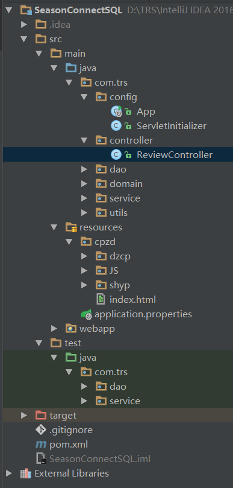

# Study4
评论互动功能实现

## 数据库设计

```sql
-- 创建评论表
create table review(
RID int auto_increment primary key,  	        -- 评论的编号
RNAME varchar(20) not null,		        -- 评论商品的名字
RCONTENT varchar(200) not null,			-- 评论内容
RDATE DATETIME					-- 评论时间
);
```

## 后台


1、Season启动类：APP.java
```java
package com.trs.config;
import com.season.core.spring.SeasonApplication;
import com.season.core.spring.SeasonRunner;

/**
 * Created by wangjie on 2016/10/14 0014.
 */
public class App extends SeasonApplication {

    public static void main(String[] args){
        SeasonRunner.run(App.class,args);
    }

}
```

2、配置启动类：ServletInitializer.java
```java
package com.trs;
import com.season.core.spring.SeasonApplication;
import com.season.core.spring.SeasonRunner;
import org.springframework.boot.autoconfigure.EnableAutoConfiguration;
import org.springframework.boot.autoconfigure.jdbc.DataSourceBuilder;
import org.springframework.context.annotation.Bean;
import org.springframework.context.annotation.ComponentScan;
import org.springframework.context.annotation.Configuration;
import org.springframework.jdbc.core.JdbcTemplate;
import org.springframework.jdbc.datasource.DriverManagerDataSource;
import org.springframework.jdbc.datasource.embedded.EmbeddedDatabaseBuilder;

import javax.sql.DataSource;

/**
 * Created by wangjie on 2016/10/14 0014.
 */
@Configuration
@EnableAutoConfiguration
@ComponentScan
public class App extends SeasonApplication {

    public static void main(String[] args){
        SeasonRunner.run(App.class,args);
    }

    @Bean
    public JdbcTemplate jdbcTemplate(DataSource dataSource){
        return new JdbcTemplate(dataSource);
    }

    @Bean
    public DataSource dataSource(){
        DriverManagerDataSource ds=new DriverManagerDataSource();
        ds.setDriverClassName("com.mysql.jdbc.Driver");
        ds.setUrl("jdbc:mysql:///TRSWCMV7");
        ds.setUsername("root");
        ds.setPassword("MySQL_1234");
        return ds;
    }
}
```
3、处理请求：TestController.java
```java
package com.trs.controller;

import com.alibaba.fastjson.JSON;
import com.alibaba.fastjson.JSONArray;
import com.season.core.Controller;
import com.season.core.ControllerKey;
import com.trs.domain.Review;
import com.trs.service.ReviewService;
import org.springframework.beans.factory.annotation.Autowired;

import java.util.List;

/**
 * Created by wangjie on 2016/10/14 0014.
 */
@ControllerKey("hello")
public class TestController extends Controller {

    @Autowired
    private ReviewService reviewService;


    public void save() {
        String RName = getPara("RName");
        String RContent = getPara("RContent");
        Review review=new Review(RName,RContent);
        int a=reviewService.saveReview(review);
        renderText("受影响的行数"+a);   //http://localhost:8080/hello/save?RName=WJ&RContent=%E5%86%85%E5%AE%B9%E7%95%8C%E9%9D%A2&URL=asdasdasdasd
    }

    public void get() {
        String RName=getPara("RName");
        List<Review> lists=reviewService.getReviewByName(RName);
        JSON json= (JSON) JSONArray.toJSON(lists);
        renderText(json.toJSONString());
    }
}
```

4、数据库层：ReviewDao.java
```java
package com.trs.dao;

import com.trs.domain.Review;
import org.springframework.beans.factory.annotation.Autowired;
import org.springframework.jdbc.core.JdbcTemplate;
import org.springframework.jdbc.core.RowMapper;
import org.springframework.stereotype.Repository;

import java.sql.*;
import java.util.List;

/**
 * Created by wangjie on 2016/10/15 0015.
 */
@Repository
public class ReviewDao {


    @Autowired
    private  JdbcTemplate jdbcTemplate;

    public List<Review> getReviewsByName(String Rname){
        String sql = "SELECT * FROM review where RNAME=?";
        Object[] params=new Object[]{Rname};
        return jdbcTemplate.query(sql, params, new RowMapper<Review>() {
            @Override
            public Review mapRow(ResultSet resultSet, int i) throws SQLException {
                Review review=new Review();
                review.setRID(resultSet.getInt("RID"));
                review.setCONTENT(resultSet.getString("RCONTENT"));
                review.setRNAME(resultSet.getString("RNAME"));
                review.setRDATE(resultSet.getDate("RDATE"));
                return review;
            }
        });
    }


//    public List<Review> getReviewsByName(String Rname) {
//        Connection connection = null;
//        PreparedStatement preparedStatement = null;
//        ResultSet RS = null;
//        try {
//            Class.forName("com.mysql.jdbc.Driver");
//            connection = DriverManager.getConnection("jdbc:mysql:///TRSWCMV7", "root", "MySQL_1234");
//            String sql = "SELECT * FROM review where RNAME=?";
//            preparedStatement = connection.prepareStatement(sql);
//            preparedStatement.setString(1, Rname);
//            RS = preparedStatement.executeQuery();
//            List<Review> lists = new ArrayList<Review>();
//            while (RS.next()) {
//                lists.add(new Review(RS.getString(2), RS.getString(3), RS.getDate(4)));
//            }
//            return lists;
//        } catch (Exception e) {
//            return null;
//        } finally {
//            try {
//                if (RS != null)
//                    RS.close();
//                if (preparedStatement != null)
//                    preparedStatement.close();
//                if (connection != null)
//                    connection.close();
//            } catch (SQLException e) {
//            }
//        }
//    }

//    public void saveReview(Review review) {
//        Connection connection = null;
//        PreparedStatement preparedStatement = null;
//        try {
//            Class.forName("com.mysql.jdbc.Driver");
//            connection = DriverManager.getConnection("jdbc:mysql:///TRSWCMV7", "root", "MySQL_1234");
//            String sql = "INSERT INTO review(RNAME,RCONTENT) values(?,?)";
//            preparedStatement = connection.prepareStatement(sql);
//            preparedStatement.setString(1, review.getRNAME());
//            preparedStatement.setString(2, review.getCONTENT());
//            preparedStatement.execute();
//        } catch (Exception e) {
//        }
//    }

    public int saveReview(Review review){
        String sql="INSERT INTO review(RNAME,RCONTENT) values(?,?)";
        Object[] params=new Object[]{review.getRNAME(),review.getCONTENT()};
        return jdbcTemplate.update(sql,params);
    }
}
```

5、实体类：Review.java
```java
package com.trs.domain;


import java.sql.Date;

/**
 * Created by wangjie on 2016/10/14 0014.
 * 实体类
 */
public class Review {

    private int RID;
    private String RNAME;
    private String CONTENT;
    private Date RDATE;     //向数据库插入的时候，使用触发器。

    public int getRID() {
        return RID;
    }

    public void setRID(int RID) {
        this.RID = RID;
    }

    public String getRNAME() {
        return RNAME;
    }

    public void setRNAME(String RNAME) {
        this.RNAME = RNAME;
    }

    public String getCONTENT() {
        return CONTENT;
    }

    public void setCONTENT(String CONTENT) {
        this.CONTENT = CONTENT;
    }

    public Date getRDATE() {
        return RDATE;
    }

    public void setRDATE(Date RDATE) {
        this.RDATE = RDATE;
    }

    public Review(String RNAME, String CONTENT) {
        this.RNAME = RNAME;
        this.CONTENT = CONTENT;
    }

    public Review(String RNAME, String CONTENT,Date DATE) {
        this.RNAME = RNAME;
        this.CONTENT = CONTENT;
        this.RDATE=DATE;
    }


    @Override
    public String toString() {
        return "Review{" +
                "RID=" + RID +
                ", RNAME='" + RNAME + '\'' +
                ", CONTENT='" + CONTENT + '\'' +
                ", RDATE=" + RDATE +
                '}';
    }

    public Review() {
    }
}
```

6、业务层：ReviewService.java  
```java
package com.trs.service;

import com.trs.dao.ReviewDao;
import com.trs.domain.Review;
import org.springframework.beans.factory.annotation.Autowired;
import org.springframework.stereotype.Service;

import java.util.List;

/**
 * Created by wangjie on 2016/10/14 0014.
 */
@Service
public class ReviewService {

    @Autowired
    private ReviewDao reviewDao;

    /***
     * 按照名称查找所有评论
     * @param Rname
     * @return
     */
    public List<Review> getReviewByName(String Rname){
        return reviewDao.getReviewsByName(Rname);
    }

    /**
     * 保存评论
     * @param review
     */
    public int saveReview(Review review){
        return reviewDao.saveReview(review);
    }

}
```

7、配置文件 pom.xml
```xml
<?xml version="1.0" encoding="UTF-8"?>
<project xmlns="http://maven.apache.org/POM/4.0.0"
         xmlns:xsi="http://www.w3.org/2001/XMLSchema-instance"
         xsi:schemaLocation="http://maven.apache.org/POM/4.0.0 http://maven.apache.org/xsd/maven-4.0.0.xsd">
    <modelVersion>4.0.0</modelVersion>

    <groupId>trs.com.cn1</groupId>
    <artifactId>SeasonConnectSQL</artifactId>
    <version>1.0-SNAPSHOT</version>
    <packaging>war</packaging>

    <parent>
        <artifactId>season-parent</artifactId>
        <groupId>trs.com.cn</groupId>
        <version>1.2</version>
    </parent>

    <dependencies>
        <dependency>
            <groupId>trs.com.cn</groupId>
            <artifactId>season-core</artifactId><!-- 其中包含了好多依赖  -->
            <!--   要运行在其他Tomcat服务器上时，要打成war包，并需要取消注释
                <exclusions>
                    <exclusion>
                        <groupId>org.springframework.boot</groupId>
                        <artifactId>spring-boot-starter-tomcat</artifactId>
                    </exclusion>
                </exclusions>
            -->
        </dependency>
        <!--   同上
                 <dependency>
                        <groupId>javax.servlet</groupId>
                        <artifactId>servlet-api</artifactId>
                        <version>2.5</version>
                        <scope>provided</scope>
                </dependency>
        -->
    </dependencies>

    <build>
        <finalName>SeasonConnectSQL</finalName>
    </build>

    <build>
        <finalName>SeasonConnectionSQL</finalName>
        <plugins>
            <plugin>
                <groupId>org.springframework.boot</groupId>
                <artifactId>spring-boot-maven-plugin</artifactId>
            </plugin>
        </plugins>
    </build>

</project>
```

## 前台商品详细信息模板代码
```html
<!DOCTYPE html PUBLIC "-//W3C//DTD XHTML 1.0 Transitional//EN http://www.w3.org/TR/xhtml1/DTD/xhtml1-transitional.dtd">
<html lang="cn">
<head>
<META content="text/html; charset=UTF-8" http-equiv=Content-Type>
<h1 style="display:none" class="nav_hide">产品详情</h1>
<title>产品详情</title>

<script type="text/javascript" src="../../JS/jquery-1.11.1.js"></script>
<script type="text/javascript">
$(document).ready(function(){

//显示所有商品的所有评论

$("#b05").click(function(){
	 $.getJSON("http://localhost:8080/SeasonConnectSQL/hello/get",
	 {"RName":$("#b05_1").attr("value")},   //向后台传递参数  商品的名称！！！
	 function(data) {
        $("#myDiv5").html("");
        $.each(data, function(i, item) {
            $("#myDiv5").append(
		 "<div>游客" + (i+1) + "</div>" + 
                    "<div>" + item.cONTENT + "</div>" + 
                    "<div>" + item.rDATE    + "</div>" +
                    "<div>" + item.rNAME + "</div><hr/>");
        });
        });
   });

//提交评论信息

$("#b06").click(function(){
	 $.getJSON("http://localhost:8080/SeasonConnectSQL/hello/save",
	 {RName:$("#b05_1").attr("value"),RContent:$("input[id='b06_1']").val()},   //向后台传递参数  商品的名称,商品评价！！！！
	 function(data) {
        $("#myDiv5").html("");
        $.each(data, function(i, item) {
           
        });
        });
   });

})
</script>

</head>

<body>


<div style="margin:0 auto; width:950px;">

<TRS_XAPPENDIXS ID="OWNER" MODE="PIC">
 ' border=0 alt="图片不存在！" width="80" height="80" /> 
</TRS_XAPPENDIXS>  <br/>


<h2>显示商品详情：</h2>

<TRS_DOCUMENT field="DOCCONTENT"  dateformat="yyyy-MM-dd HH:mm:ss" autocolor="TRUE" autoformat="FALSE" autoformattype="HTML" autolink="FALSE"  target="_blank" linkalt="FALSE" ></TRS_DOCUMENT>

<br/>
<h2>显示评论：</h2><br/>

<!--使用模板显示评论表中的信息评论-->
<TRS_DEFOBJECTS TABLENAME="review" IDFIELDNAME="RID" where="RNAME='电脑'">
评论内容：<TRS_DEFOBJECT FIELD="RCONTENT"/><br/>
发布时间：<TRS_DEFOBJECT FIELD="RDATE" DATEFORMAT="yyyy-MM-dd"/><br/><br/>
</TRS_DEFOBJECTS>


<!--使用JS解析JSON数据-->
<div id="myDiv5"><h2>显示评论</h2></div>
<input id="b05_1" type="hidden" name="content" title="Review Content" value="<TRS_DOCUMENT field="DOCTITLE"          ></TRS_DOCUMENT>" /><br/>
<button id="b05" type="button">显示更多评论</button><br/>

   请书写评论：<input id="b06_1" type="text" name="text" title="Review Content" />
<button id="b06" type="button">提交评论：</button> 

</div>

</body>
</html> 
```


